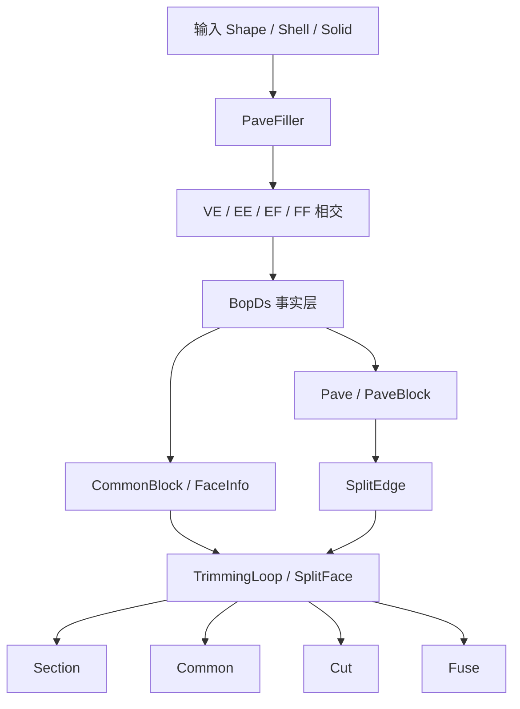

# Truck BOP PaveFiller Migration Plan

## 1. 背景与目标

目标不是逐行复刻 OCCT 的 `BOPAlgo_PaveFiller`，而是把它在布尔运算里的**核心职责**完整迁移到 `truck-bop`：

1. 把 `VE / EE / EF / FF` 的相交结果统一收敛为“边参数空间里的切分点”；
2. 基于这些切分点构建 `Pave / PaveBlock / CommonBlock / FaceInfo`；
3. 进一步生成 `SplitEdge / TrimmingLoop / SplitFace`；
4. 最终打通 `section / common / cut / fuse` 的公共前置流水线。

一句话概括：

> 把 OCCT 的 “PaveFiller + DS” 思想，迁移成 `truck-bop` 内部统一的相交事实源与切分调度器。

---

## 2. 当前现状（已验证事实）

### 2.1 `truck-new` 已有能力

当前 `truck-bop` 并不是从零开始，已经具备了迁移所需的几个关键基础：

- 已有 `Pave`
  - 文件：`truck-bop/src/bopds/pave.rs`
  - 当前字段已经包含 `edge / vertex / parameter / tolerance`
- 已有 `PaveBlock`
  - 文件：`truck-bop/src/bopds/pave_block.rs`
  - 当前能表达原始边上的一个参数区间段
- 已有 `BopDs`
  - 文件：`truck-bop/src/bopds/mod.rs`
  - 已能持有 `paves / pave_blocks / face_info / interferences`
- 已有局部相交模块
  - `truck-bop/src/intersect/ve.rs`
  - `truck-bop/src/intersect/ee.rs`
  - `truck-bop/src/intersect/ef.rs`
  - `truck-bop/src/intersect/ff.rs`
- 已有后段 trim / split-face / shell-assembly 主线
  - 文件：`truck-bop/src/trim.rs`
- 已有一批对 trim 管线很有价值的回归测试
  - 例如：
    - `shared_vertex_only_faces_still_form_one_component`
    - `shared_edge_faces_create_orientation_adjacency`
    - `shell_assembly_groups_faces_by_shared_topology_components`

### 2.2 当前缺口

与 OCCT 的 `PaveFiller + BOPDS_DS` 相比，当前 `truck-bop` 还缺以下关键层：

1. **缺统一调度器**
   - 目前相交与后处理仍然是分散的；
   - 没有一个统一的 `PaveFiller`-style 流程来串联 `VE -> EE -> EF -> FF -> split -> trim`。

2. **`FaceInfo` 只是占位**
   - 文件：`truck-bop/src/bopds/face_info.rs`
   - 目前没有 OCCT 风格的 `On / In / Sc` 三套事实池。

3. **`CommonBlock` 只是占位**
   - 文件：`truck-bop/src/bopds/common_block.rs`
   - 还不能表达“多个重合 pave block 的共享组”。

4. **`EE` 只返回参数对，没有落库**
   - 文件：`truck-bop/src/intersect/ee.rs`
   - 目前更像求交工具函数，而不是 DS 事实生产者。

5. **`EF / FF` 结果没有完整落到切分结构**
   - 已有 interference / section curve，但尚未统一进入：
     - `pave block`
     - `common block`
     - `face state`
     - `split edge`

6. **Public API 仍未接通**
   - 文件：`truck-bop/src/lib.rs`
   - `common / fuse / cut / section` 仍为 `NotImplemented`

---

## 3. 迁移原则

### 3.1 不做逐行镜像

不建议把 OCCT 的类层级、命名和所有内部表逐字照搬到 Rust。原因：

- `truck-bop` 现有代码已经有自己的模块划分；
- Rust 类型系统与 OCCT 的 Handle + mutable DS 模式不同；
- 当前最值钱的是 **“语义迁移”**，而不是 **“类结构复刻”**。

### 3.2 优先迁移职责闭环

本次迁移应优先保留以下职责闭环：

```text
VE / EE / EF / FF
  -> parameter paves
  -> pave blocks
  -> common blocks / face states
  -> split edges
  -> trimming loops / split faces
  -> section / common / cut / fuse
```

### 3.3 先补数据层，再接 public API

推荐采用“数据层先行”的方式：

1. 先把 `BopDs` 升级成真正的事实源；
2. 再引入统一 `PaveFiller` 调度器；
3. 最后接通 `section / common / cut / fuse`。

这样可以最大程度复用当前 `trim.rs` 已验证通过的后段逻辑，避免一次性推倒重来。

---

## 4. 目标架构

### 4.1 推荐架构图



### 4.2 模块落点

建议增补和调整如下文件：

#### 新增

- `truck-bop/src/pave_filler.rs`

#### 修改

- `truck-bop/src/lib.rs`
- `truck-bop/src/pipeline.rs`
- `truck-bop/src/trim.rs`
- `truck-bop/src/bopds/mod.rs`
- `truck-bop/src/bopds/pave_block.rs`
- `truck-bop/src/bopds/common_block.rs`
- `truck-bop/src/bopds/face_info.rs`
- `truck-bop/src/bopds/interference.rs`
- `truck-bop/src/intersect/ve.rs`
- `truck-bop/src/intersect/ee.rs`
- `truck-bop/src/intersect/ef.rs`
- `truck-bop/src/intersect/ff.rs`

---

## 5. 开发方案（推荐方案 A）

## 5.1 方案 A：语义对齐优先，最小侵入接管（推荐）

### 核心思想

- 保留现有 `trim.rs` 主线；
- 不大改现有几何求交模块的内部求解方式；
- 新增一个 Rust 风格的 `PaveFiller`，负责：
  - 调用现有相交模块
  - 把结果写进 `BopDs`
  - 驱动 `SplitPaveBlocks / MakeSplitEdges / BuildTrimmingLoops / BuildSplitFaces`

### 优点

- 与现有代码最兼容；
- 风险最小；
- 能逐阶段落测试；
- 容易保持当前 trim 回归矩阵不倒退。

### 缺点

- 中间阶段会出现一段“新旧共存”的代码；
- `BopDs` 和 `trim.rs` 之间需要做几次接口收敛。

## 5.2 方案 B：一次性重构为 `PaveFiller + Builder` 分层（不推荐首轮）

### 核心思想

- 直接把 `truck-bop` 重构为类似 OCCT 的：
  - `PaveFiller`
  - `Builder`
  - `Section`
  - `Boolean`

### 风险

- 改动面太大；
- 当前 `trim.rs` 的稳定性会被打断；
- 难以在中间阶段保持全部测试绿灯。

### 结论

首轮不建议采用。等方案 A 跑通后，如果需要进一步整理 API，再考虑第二阶段重构。

---

## 6. Implementation Plan（分阶段开发计划）

## Phase 0：冻结事实源与基线

### 目标

先把当前可复跑基线固定下来，避免迁移过程中失去比较对象。

### 任务

- [ ] 记录当前 `truck-bop` 的 `cargo test -p truck-bop`
- [ ] 记录 `cargo check -p truck-bop`
- [ ] 记录 `cargo check --release -p truck-bop`
- [ ] 记录当前 trim 关键测试矩阵

### 基线命令

```bash
cargo test -p truck-bop
cargo check -p truck-bop
cargo check --release -p truck-bop
```

---

## Phase 1：升级 `BopDs` 为统一事实源

### 目标

把当前占位型 DS 升级成可承接 `PaveFiller` 的真实数据层。

### 任务

- [ ] 扩展 `FaceInfo`，拆分为：
  - `on_vertices`
  - `in_vertices`
  - `sc_vertices`
  - `on_pave_blocks`
  - `in_pave_blocks`
  - `sc_pave_blocks`
- [ ] 扩展 `CommonBlock`，支持：
  - 多个 `pave_block`
  - representative / canonical block
  - tolerance / semantic kind
- [ ] 在 `BopDs` 中新增：
  - `common_blocks`
  - `pave_block_to_common_block`
  - `interference_pairs`
- [ ] 规范 `edge -> paves -> pave_blocks` 的 rebuild API

### 目标结果

使 `BopDs` 能作为整个相交-切分-组装阶段的事实源，而不是临时缓存。

### 测试迁移

新增测试：

- [ ] `face_info_tracks_on_in_sc_separately`
- [ ] `common_block_can_group_multiple_pave_blocks`
- [ ] `bopds_can_bind_pave_block_to_common_block`
- [ ] `bopds_can_store_interference_pair_index`

---

## Phase 2：统一 `PaveBlock` 生命周期

### 目标

把 `PaveBlock` 从“静态参数区间”升级成“可被追加切分点、可被再次细分”的真实切分单元。

### 任务

- [ ] 在 `PaveBlock` 中加入 `ext_paves`
- [ ] 增加 `result_edge` 或等价映射，用于切分后结果边关联
- [ ] 增加 `split_pave_blocks_for_edges(...)`
- [ ] 为 micro-segment / tolerance 重合段定义 `unsplittable` 语义

### 测试迁移

- [ ] `split_pave_blocks_inserts_extra_paves_in_sorted_order`
- [ ] `split_pave_blocks_creates_n_minus_one_blocks_after_extra_paves`
- [ ] `unsplittable_micro_segment_is_preserved_but_not_split_again`

---

## Phase 3：把 `VE` 升级为后处理可消费事实

### 目标

把当前 `VE` 从“直接加一个 pave”升级成“命中 pave block -> 追加 ext pave -> split”的统一流程。

### 任务

- [ ] `VE` 命中边上对应 block，而不是只向全局 `paves` 追加
- [ ] 命中 endpoint 时复用已有端点 `pave`
- [ ] 命中新参数点时：
  - 生成 vertex
  - 追加到 block `ext_paves`
  - 触发该 edge 的 block split

### 测试迁移

- [ ] `ve_intersection_appends_extra_pave_into_matching_block`
- [ ] `ve_intersection_splits_edge_after_extra_pave_is_added`
- [ ] `ve_intersection_does_not_duplicate_existing_endpoint_pave`

---

## Phase 4：把 `EE` 升级为共享顶点 / 共享段事实

### 目标

让 `EE` 不再只是 `(edge1, edge2, t1, t2)` 的参数对函数，而是真正写回 `BopDs`。

### 任务

- [ ] 扩展 `EEInterference`
  - `VertexHit`
  - `OverlapHit`
- [ ] 对单点交：
  - 共用或新建 vertex
  - 在两条边对应 block 上追加 ext paves
- [ ] 对共线重合：
  - 生成 paired `pave blocks`
  - 建立 `CommonBlock`
- [ ] 明确 EE 与 trim 所需 shared-boundary 事实的映射关系

### 测试迁移

- [ ] `ee_perpendicular_segments_create_shared_vertex_and_split_both_edges`
- [ ] `ee_endpoint_touch_reuses_existing_vertices_without_duplicate_split`
- [ ] `ee_colinear_overlap_creates_common_block_not_single_vertex_only`

---

## Phase 5：把 `EF` 接到 `FaceInfo` 与切分闭环

### 目标

使 `EF` 不只是“边与面有交”，而是能把交点/共线段归入 face state 和 block 事实中。

### 任务

- [ ] 扩展 `EFInterference`
  - point-hit
  - overlap-hit
- [ ] point-hit：
  - 更新 edge paves
  - 写入 `FaceInfo` 顶点状态
- [ ] overlap-hit：
  - 生成或绑定 `pave block`
  - 写入 `FaceInfo.on_pave_blocks`
  - 必要时生成 `CommonBlock`

### 测试迁移

- [ ] `ef_point_intersection_updates_face_on_or_in_state`
- [ ] `ef_intersection_adds_edge_parameter_pave_for_split`
- [ ] `ef_edge_on_face_boundary_is_promoted_to_common_block`

---

## Phase 6：把 `FF` 的 section curve 升级为 section-edge block

### 目标

把 `FF` 从“求出 section curve”升级成“为 trimming / section 提供可消费的 section-edge blocks”。

### 任务

- [ ] 保留现有 `SectionCurve`
- [ ] 给 `SectionCurve` 增加 curve 上的 `paves`
- [ ] 由 curve 上相邻 `paves` 生成 section-edge `pave blocks`
- [ ] 同时登记到两个相交面的 `FaceInfo.sc_pave_blocks`
- [ ] 与 `trim.rs::build_trimming_loops()` 对接

### 测试迁移

- [ ] `ff_section_curve_projects_ef_vertices_into_curve_paves`
- [ ] `ff_section_edge_is_registered_in_both_faces_sc_pool`
- [ ] `ff_closed_loop_section_enables_trimming_loop_construction`

---

## Phase 7：新增统一 `PaveFiller` 调度器

### 目标

新增统一前置流水线，接管布尔运算的相交与切分调度。

### 任务

- [ ] 新增 `truck-bop/src/pave_filler.rs`
- [ ] 对外暴露统一入口，例如：
  - `build_interferences`
  - `fill_paves`
  - `split_pave_blocks`
  - `make_split_edges`
  - `make_blocks`
  - `build_trimming_loops`
  - `build_split_faces`
- [ ] 让 `section()`、`common()` 先接真主链
- [ ] 后续再让 `cut()`、`fuse()` 接入

### 建议执行顺序

```text
VV (可选占位)
-> VE
-> EE
-> VF
-> EF
-> FF
-> split_pave_blocks
-> make_split_edges
-> make_blocks
-> build_trimming_loops
-> build_split_faces
```

### 测试迁移

- [ ] `section_pipeline_runs_ve_ee_ef_ff_and_builds_split_edges`
- [ ] `common_pipeline_returns_not_notimplemented_for_two_boxes`

---

## Phase 8：接通 `cut / fuse / common / section`

### 目标

在不破坏现有 trim 后段的前提下，逐个接通 public API。

### 任务

- [ ] `section()`
  - 优先接通，作为最薄的一层输出
- [ ] `common()`
  - 复用 split face 分类逻辑先打通
- [ ] `cut()`
  - 基于 split face + classify + assemble 实现
- [ ] `fuse()`
  - 最后接通，处理 shared topology 合并

### 复用链路

优先复用现有：

- `build_split_faces`
- `classify_split_faces_against_operand`
- `merge_equivalent_vertices`
- `sew_fragment_edges`
- `assemble_shells`
- `build_solids_from_shells`

### 测试迁移

- [ ] `common_two_overlapping_boxes_returns_closed_solid`
- [ ] `cut_box_minus_box_returns_closed_solid_with_expected_component_count`
- [ ] `fuse_two_touching_boxes_reuses_shared_topology_without_open_shell`

---

## Phase 9：全量回归与收口

### 目标

确保迁移后的前置流水线与现有 trim 后段完整收敛，不引入结构性回退。

### 任务

- [ ] 跑新增 DS / intersect / filler 测试
- [ ] 跑既有 trim 回归矩阵
- [ ] 跑 `cargo test -p truck-bop`
- [ ] 跑 `cargo check -p truck-bop`
- [ ] 跑 `cargo check --release -p truck-bop`
- [ ] 检查 `deny(warnings)` 相关 release 行为

---

## 7. 测试迁移方案

测试迁移不建议“一次性搬 OCCT 全量 case”，而应采用三层策略。

## 7.1 第一层：保留并扩展当前 `truck-bop` 已有测试

这些测试已经贴近当前 Rust 实现，应原地保留并逐步增强：

- `pave_sorting_adds_missing_edge_endpoints`
- `paveblock_creation_creates_one_block_per_consecutive_pair`
- `ve_intersection_detects_vertex_on_edge_and_generates_pave`
- `ff_plane_plane_section_generates_section_curve`

作用：

- 保护当前已有语义；
- 为后续测试扩展提供稳定起点。

## 7.2 第二层：迁移 OCCT 语义级测试，而不是源码级测试

重点迁移的是“语义合同”，不是 OCCT 内部类接口。

建议迁移的 OCCT 语义主题：

1. **边上参数切分点**
   - 交点必须落到边参数上，而不只是 3D 点
2. **相邻 pave 构成 pave block**
   - block 数量应由排序后的切分点数量决定
3. **共线重合必须形成 common block**
   - 不能退化成多个离散点
4. **face-face 交线必须写入两个面的 section 池**
5. **split edge 必须可回溯原始 edge provenance**

这部分测试就是上面 Phase 1-8 里列出的新增测试矩阵。

## 7.3 第三层：现有 trim 回归矩阵作为总保护网

以下现有测试应保留为最终验收网：

- `boundary_loops_preserve_original_edge_provenance`
- `edge_sewing_tracks_source_boundary_identity_for_shared_faces`
- `shared_vertex_only_faces_still_form_one_component`
- `shared_edge_faces_create_orientation_adjacency`
- `shell_assembly_groups_faces_by_shared_topology_components`
- `shell_closure_rejects_boundary_edge_component`
- `shell_orientation_rejects_closed_shell_with_inverted_faces`

原因：

这些测试已经覆盖了当前 `truck-bop` 在“碎片 -> shell -> solid”阶段最容易回退的地方，是比单点求交更接近业务结果的保护网。

---

## 8. 任务清单（Task List）

### 会话 A：数据层收敛

- [ ] Phase 0
- [ ] Phase 1
- [ ] Phase 2

### 会话 B：单边与双边切分

- [ ] Phase 3
- [ ] Phase 4

### 会话 C：面侧状态与 section

- [ ] Phase 5
- [ ] Phase 6

### 会话 D：统一调度器与 public API

- [ ] Phase 7
- [ ] Phase 8
- [ ] Phase 9

---

## 9. 风险与缓解

### 风险 1：`PaveBlock` 重构影响现有 trim 主线

缓解：

- 先保证旧字段可兼容；
- 先在 DS 层加字段，不急于改 trim 消费侧；
- 逐阶段把 trim 改为消费新事实。

### 风险 2：`EE / EF / FF` 语义混用导致重复切分

缓解：

- 在 `BopDs` 中增加 interference pair 去重；
- `pave` 归一化必须始终按 `(edge, parameter)` 收敛。

### 风险 3：共线重合段难以稳定归组

缓解：

- 先把 `OverlapHit` 独立建模；
- 先支持最常见的线段/圆弧重合场景；
- 复杂曲线重合放到第二轮增强。

### 风险 4：public API 提前接通导致表面可用、内部失真

缓解：

- 按 `section -> common -> cut -> fuse` 顺序逐步接；
- 每接一个 API 都补最小闭环测试。

---

## 10. 验收标准

满足以下条件，才算首轮迁移完成：

- [ ] `BopDs` 能完整表达：
  - `Pave`
  - `PaveBlock`
  - `CommonBlock`
  - `FaceInfo(On / In / Sc)`
  - `VE / EE / EF / FF`
- [ ] 四类交叉都能统一收敛到“边参数空间切分点”
- [ ] `SplitPaveBlocks` / `MakeSplitEdges` 打通
- [ ] `FF` 生成的 section-edge block 能进入 `FaceInfo.sc_pave_blocks`
- [ ] `section / common / cut / fuse` 不再是 `NotImplemented`
- [ ] 当前 trim 回归矩阵不回退
- [ ] 以下命令全绿：

```bash
cargo test -p truck-bop
cargo check -p truck-bop
cargo check --release -p truck-bop
```

---

## 11. 最终建议

### 建议结论

推荐采用 **方案 A：语义对齐优先，最小侵入接管**。

### 原因

因为 `truck-bop` 当前已经有：

- `Pave / PaveBlock`
- `VE / EF / FF` 的基础相交结构
- `trim.rs` 的可运行后段

所以最优路径不是“推倒重写”，而是：

1. 把 `BopDs` 升级成真实事实层；
2. 把各相交模块的输出统一收敛到 `pave / pave block / common block / face info`；
3. 引入统一 `PaveFiller` 调度器；
4. 最后接通 `section / common / cut / fuse`。

### 建议执行顺序

优先顺序建议如下：

```text
FaceInfo / CommonBlock / PaveBlock 生命周期
-> VE
-> EE
-> EF
-> FF
-> PaveFiller
-> section/common
-> cut/fuse
```

这个顺序最符合当前 `truck-bop` 的现状，也最容易在每一步都留下可回归的测试证据。


## 12. Trim provenance milestone snapshot (2026-04-01)

The trim provenance refactor mission intentionally stopped short of the broader pave-filler work above and locked in a narrower migration boundary inside `truck-bop`.

### Delivered model changes

- `TrimmingEdge` now carries explicit `TrimmingEdgeProvenance` instead of the legacy paired `section_curve` / `original_edge` encoding.
- `TrimmingTopologyKey` is the shared identity model across trimming loops, sewn edges, and canonical rebuild logic.
- `SewnEdgeSource` stores topology keys directly, so section curves and generated edges are no longer coerced into lossy `EdgeId` fallbacks.

### Provenance categories to preserve in future work

- `SourceBoundary(EdgeId)`: source face boundary that should remain shareable across sibling fragments and shell assembly.
- `SectionCurve(SectionCurveId)`: FF-derived trimming identity that must stay stable across both owning faces and sewn open paths.
- `Generated { face, loop_index, edge_index }`: local trim/rebuild edge with no source topology; identity is intentionally fragment-scoped and must not be treated as shared topology.

### Regression expectations

- Keep characterization coverage for all three provenance categories whenever trim construction or rebuild logic changes.
- Preserve the repaired shell assembly, orientation, and fragment reuse regressions from `docs/plans/2026-03-28-truck-bop-trim-pipeline-repair-v2.md`.
- Keep `cyclic_edge_sequence_matches()` allocation-free on the reversed comparison path; do not reintroduce a temporary reversed vector for loop matching.

### Scope boundary

Future pave-filler work may build on this identity model, but it should not weaken the explicit provenance contract or collapse topology keys back into inferred `Option` combinations.
