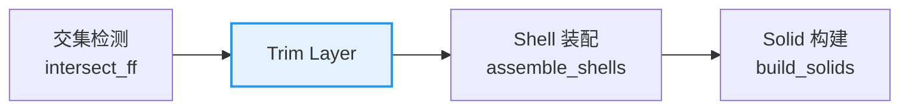
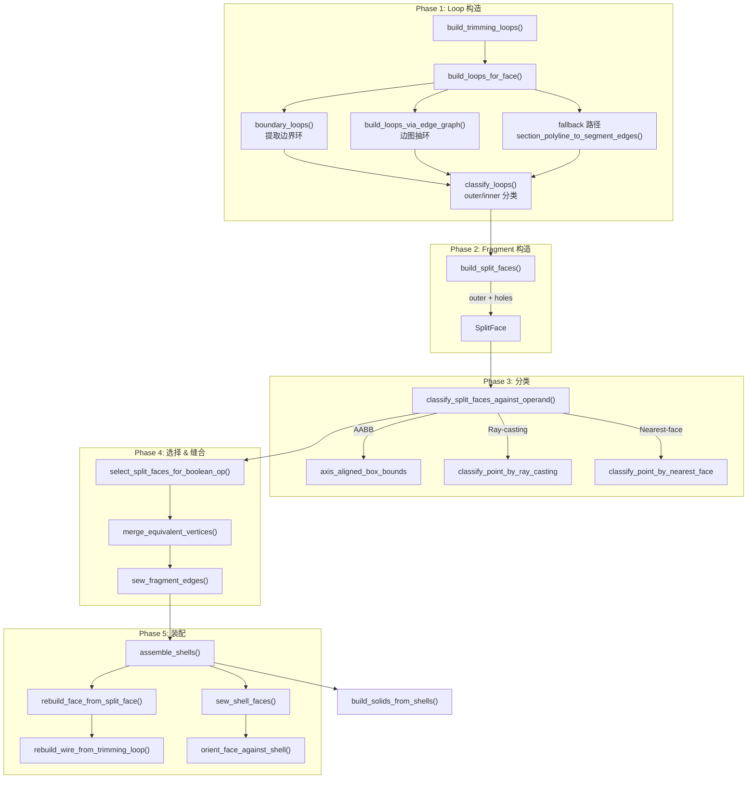
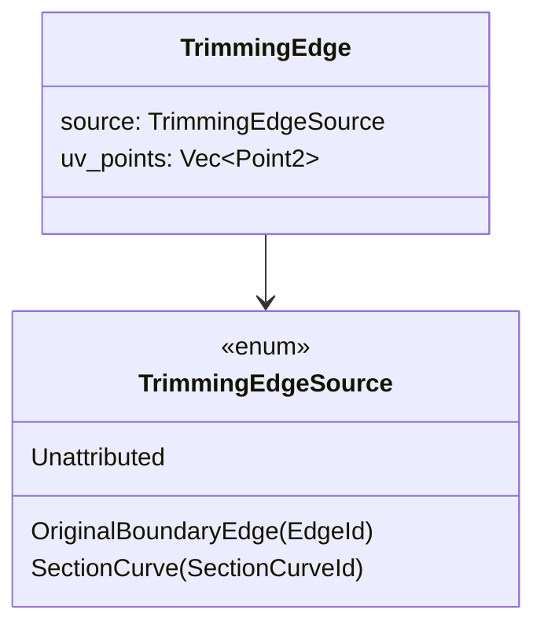
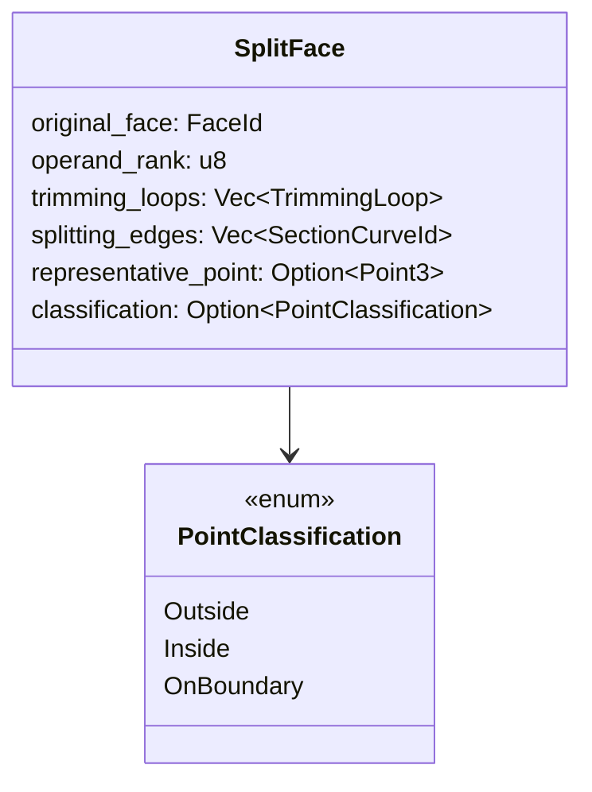
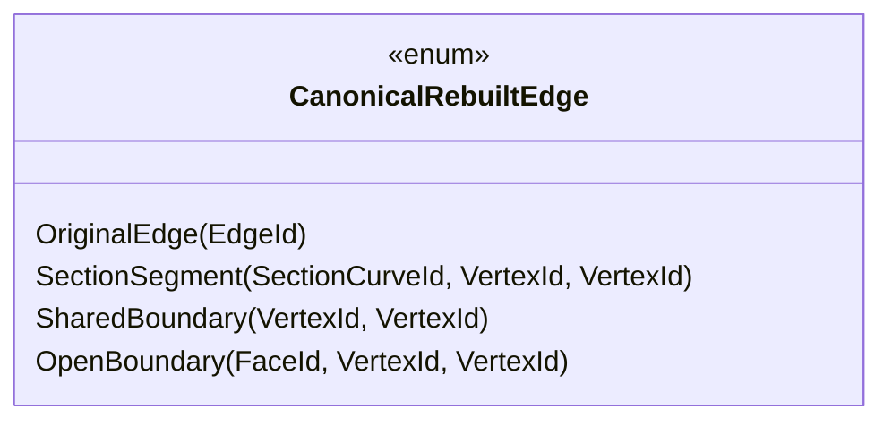
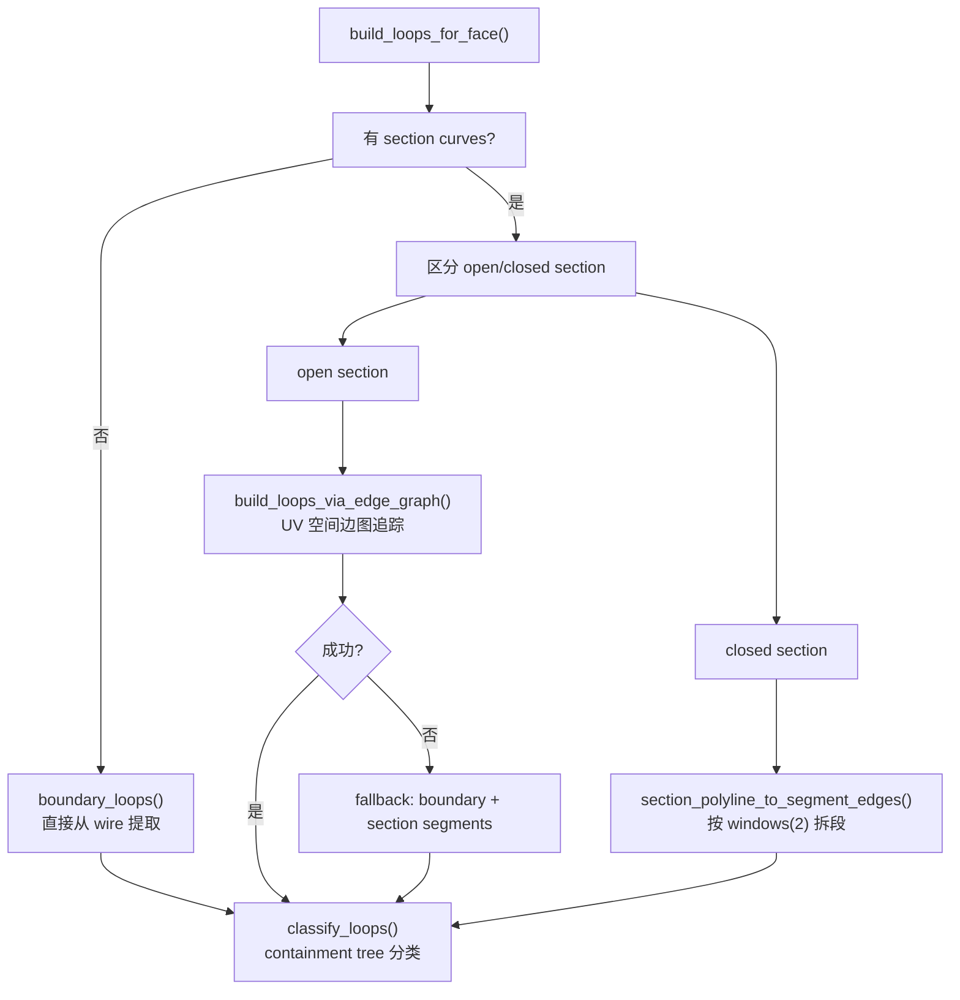
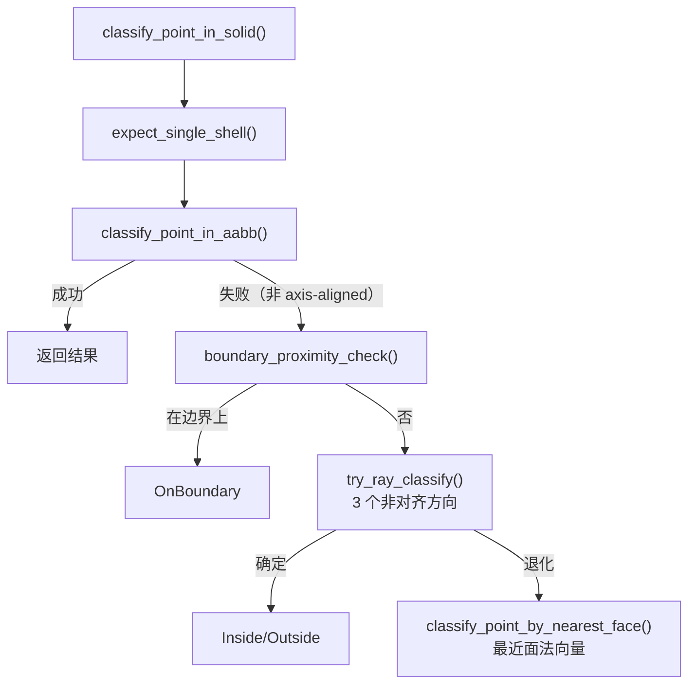
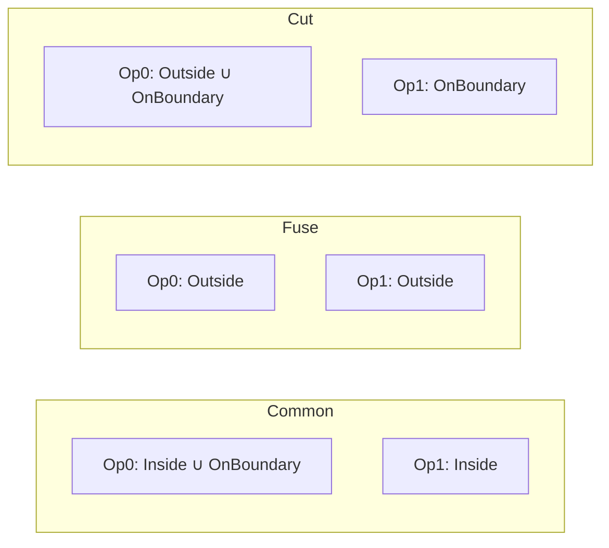
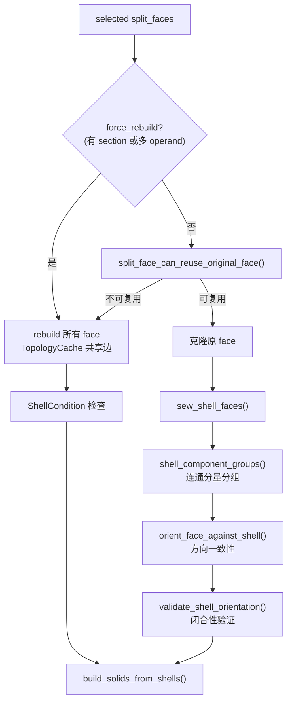
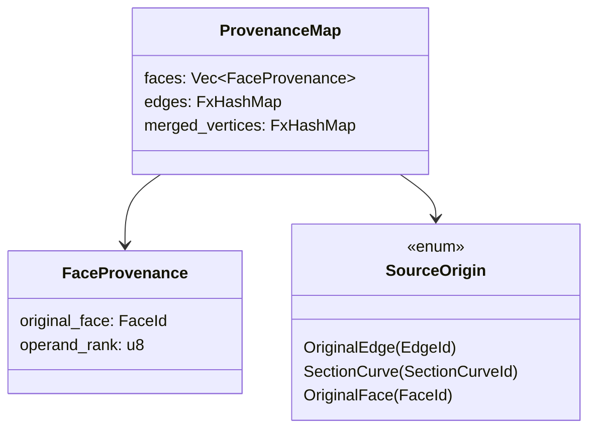

# truck-bop Trim 模块详细指南

> **范围**：`truck-bop/src/trim.rs` + `truck-bop/src/bopds/interference.rs` 中的 trimming 数据类型  
> **更新日期**：2026-04-13

---

## 1. 模块定位

Trim 模块位于布尔运算流水线的中间层，负责将交集检测产生的 section curves 转化为拓扑 fragment，再交给 shell 装配层组装成闭合壳体。



## 2. 完整流水线



## 3. 核心数据类型

### 3.1 TrimmingEdgeSource



| 变体 | 语义 | 来源 |
|------|------|------|
| `OriginalBoundaryEdge(EdgeId)` | 输入实体的边界边 | `boundary_loops()` |
| `SectionCurve(SectionCurveId)` | 面-面交线的一个段 | `section_polyline_to_segment_edges()` |
| `Unattributed` | 合成边（修复/测试） | 手动构造 |

### 3.2 TrimmingLoop

```rust
struct TrimmingLoop {
    face: FaceId,
    vertex_ids: Vec<VertexId>,    // 与 uv_points 遍历对齐
    edges: Vec<TrimmingEdge>,     // per-segment 边
    uv_points: Vec<Point2>,       // 闭合折线 (first == last)
    signed_area: f64,             // 正=CCW, 负=CW
    is_outer: bool,               // outer boundary vs hole
}
```

**关键不变量**：
- `uv_points.first() == uv_points.last()`（闭合）
- `open_loop_vertex_ids().len()` 与 `open_polygon_vertices(&uv_points).len()` 相等
- 当 `edges` 非空时，`edges.len() == open_loop_vertex_ids().len()`

### 3.3 SplitFace



### 3.4 CanonicalRebuiltEdge

用于 shell 装配时的边共享检测和 face adjacency 计算：



**双层匹配策略**：

| 场景 | 匹配逻辑 |
|------|----------|
| **面内去重** | 完整 enum 比较（段级区分） |
| **跨面共享** | `canonical_edges_share_identity()`：SectionSegment 按 `SectionCurveId` 匹配，其余按完全等价 |

## 4. Loop 构造详解

### 4.1 三条路径

`build_loops_for_face()` 根据 section curve 类型选择不同路径：



### 4.2 Edge 粒度统一

所有路径产出的 `TrimmingEdge` 都是 **per-segment** 粒度：

```
Boundary loop:  [P0→P1] [P1→P2] [P2→P3] [P3→P0]
                  ↓ OriginalBoundaryEdge(e0)  ↓ OBE(e1)  ↓ OBE(e2)  ↓ OBE(e3)

Section loop:   [P0→P1] [P1→P2] [P2→P3] [P3→P0]
                  ↓ SectionCurve(sc7)  ↓ SC(sc7)  ↓ SC(sc7)  ↓ SC(sc7)
```

### 4.3 Outer/Inner 分类

`classify_loops()` 使用 containment tree 算法：

1. 找到面积最大的 loop 作为参考方向
2. 构建包含树：每个 loop 找最小包含父 loop
3. 根据深度判定：偶数深度 = outer，奇数深度 = inner（hole）
4. 需要时反转 loop 方向（`reverse_trimming_loop`）

## 5. 点分类器



**ray-casting 实现细节**：
- Newton 法求解 `surface(u,v) = origin + t·direction`，最多 50 次迭代
- 3 个非对齐方向避免退化
- 去重 hit（tolerance 内视为同一交点）
- 奇数交点 = inside

## 6. 布尔选择规则



## 7. Shell 装配流程



## 8. Provenance 追踪



每条输出边和每张输出面都能追溯到输入实体，无需修改 `truck-topology` 核心类型。

## 9. 文件结构

| 文件 | 职责 | 行数 |
|------|------|------|
| `trim.rs` | 流水线主体：loop 构造、split face、分类、选择、缝合、装配 | ~5100 |
| `bopds/interference.rs` | 数据类型定义：TrimmingEdge, TrimmingLoop, SplitFace, SewnEdge | ~570 |
| `bopds/mod.rs` | BopDs 存储层：push/query trimming/split/sewn 数据 | ~1080 |
| `pipeline.rs` | 点分类器：classify_point_in_solid | ~750 |
| `provenance.rs` | 输出→输入追溯映射 | ~85 |

## 10. 已知限制

1. **BooleanOp::Section** — 公共 API 返回 `NotImplemented`
2. **edge-graph 路径** — section 边仍作为整条 polyline 的单个 UvEdge 进入 edge graph，在 graph 内追踪时不拆段
3. **复用 source 几何** — `rebuild_wire_from_trimming_loop` 对所有边统一用 line 重建，不复用原始 edge/section 曲线几何
4. **TrimmingLoop 无稳定 ID** — 当前用 `loop_index`（数组下标）标识 loop，顺序变化时 identity 不稳定
