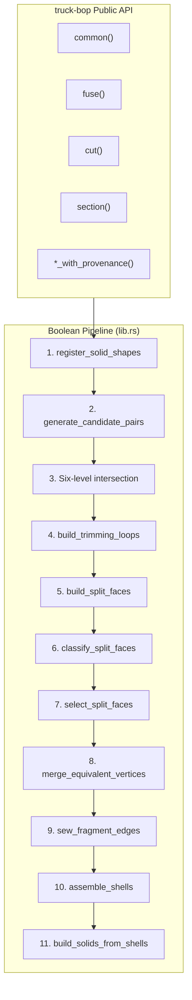
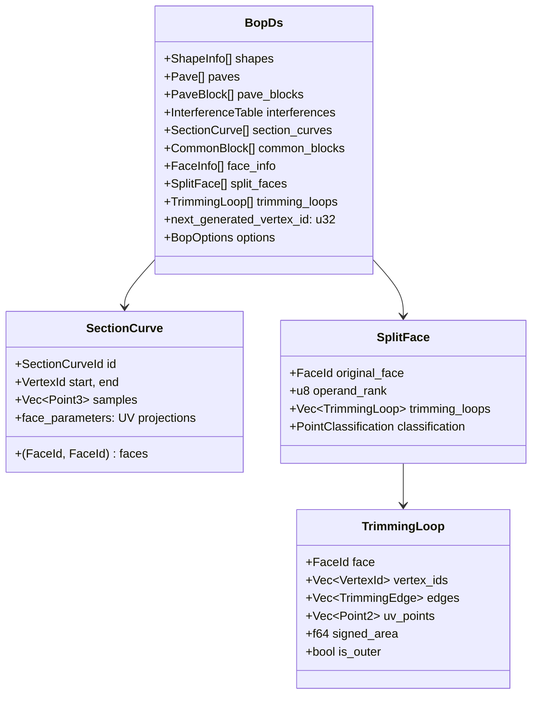
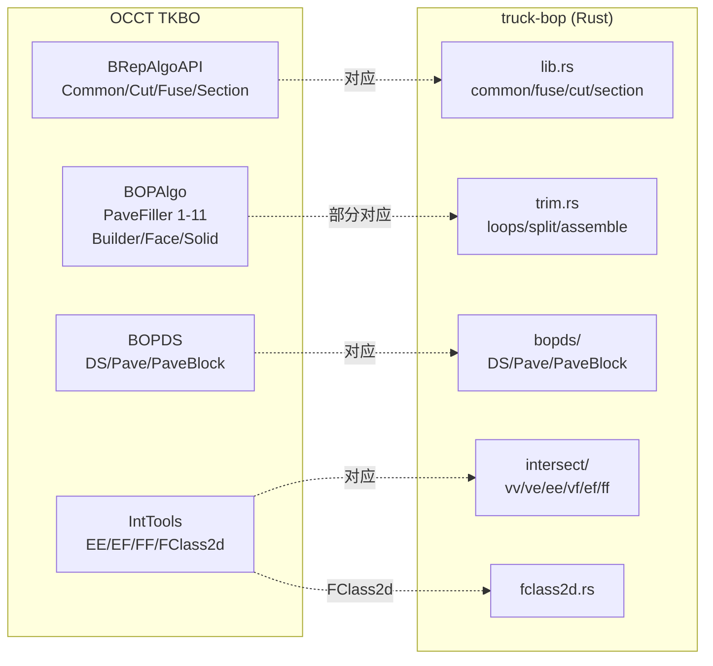

# truck-bop 布尔运算架构文档

> 版本: 2026-04-14 | 基于 commit `9259646d`
> 测试状态: 9/11 盒体用例通过 | section 操作可用

---

## 架构总览



## 模块职责

### 1. 公共 API (`lib.rs`)

| 函数 | 返回值 | 说明 |
|------|--------|------|
| `common(a, b, tol)` | `Vec<Solid>` | 两 solid 交集 |
| `fuse(a, b, tol)` | `Vec<Solid>` | 两 solid 并集 |
| `cut(a, b, tol)` | `Vec<Solid>` | a 减去 b |
| `section(a, b, tol)` | `Shell` | 交线面片（开壳） |
| `*_with_provenance()` | `BooleanResult` | 带溯源信息的变体 |

### 2. BopDs 数据结构 (`bopds/`)

中心数据结构，模仿 OCCT 的 `BOPDS_DS`，使用 typed ID + arena 存储。



### 3. 求交层 (`intersect/`)

六级渐进求交，对应 OCCT 的 `BOPAlgo_PaveFiller`:

| 级别 | 文件 | 算法 |
|------|------|------|
| VV | `vv.rs` | 坐标距离比较 |
| VE | `ve.rs` | 点到边曲线投影 |
| VF | `vf.rs` | 点到面参数投影 |
| EE | `ee.rs` | 边-边最近点对 |
| EF | `ef.rs` | 边-面交点检测 |
| FF | `ff.rs` | 面-面交线（解析平面快速路径 + mesh fallback） |

### 4. 面重建层 (`trim.rs`)

190KB 的核心模块，负责从求交结果重建拓扑：

```mermaid
flowchart LR
    subgraph LoopBuild ["Loop Construction"]
        boundary["boundary_loops()"]
        graph["build_loops_via_edge_graph()"]
        split_bd["split_boundary_at_section_endpoints()"]
        extract["extract_loops_from_graph()"]
    end

    subgraph FaceRebuild ["Face Rebuild"]
        classify_loops["classify_loops()"]
        rebuild["rebuild_face_from_split_face()"]
        cache["TopologyCache"]
    end

    subgraph ShellAssembly ["Shell Assembly"]
        assemble_fn["assemble_shells()"]
        sew_fn["sew_shell_faces()"]
        build_solid["build_solids_from_shells()"]
    end

    LoopBuild --> FaceRebuild --> ShellAssembly
```

关键组件：
- **TopologyCache**: 跨面共享顶点/边对象，使用坐标去重（10× tolerance snap）
- **VertexIdAllocator**: 类型安全的 vertex ID 分配器
- **FClass2d**: UV 空间点-面分类器，支持多 wire + 周期性参数域

### 5. 点分类器 (`pipeline.rs`)

三级策略判定点相对 solid 的位置：

1. **AABB 快速路径** — 轴对齐包围盒直接判定
2. **Ray-casting** — 多方向射线 + `FClass2d` UV 分类 → 奇偶规则
3. **Nearest-face fallback** — 最近面法向量启发式

### 6. FClass2d (`fclass2d.rs`)

移植自 OCCT `IntTools_FClass2d`：

- 从 face wire 构建 UV 空间 2D 多边形
- 支持外边界 + 孔（多 wire）
- 周期性参数域自动检测（`u_period`/`v_period`）
- 可缓存构造（`from_face` 构造一次，多次 `classify`）

### 7. Provenance (`provenance.rs`)

输出溯源：每个输出面/边可追踪到输入的源面/边。

---

## OCCT 映射



## 选择逻辑

| 操作 | operand 0 | operand 1 |
|------|-----------|-----------|
| Common | Inside + OnBoundary | Inside |
| Fuse | Outside + OnBoundary | Outside |
| Cut | Outside + OnBoundary | OnBoundary |
| Section | (交线面片) | (交线面片) |

## 已知限制

1. **共面面检测**：`adjacent_fuse`/`edge_touch_fuse` 需要 OCCT `PaveFiller` 的共面面检测（未实现）
2. **曲面体性能**：mesh-based FF 求交在 debug 模式下很慢
3. **PCurve**：离散 UV 投影（非 B-Spline 拟合）
4. **多壳 solid**：`BuilderSolid` 只支持单壳

## 文件大小分布

| 文件 | 大小 | 职责 |
|------|------|------|
| `trim.rs` | 190KB | 面重建/分类/选择/装配 |
| `bopds/mod.rs` | 39KB | BopDs 核心数据结构 |
| `intersect/ff.rs` | 32KB | 面-面交线 |
| `pipeline.rs` | 23KB | 点分类器 |
| `bopds/interference.rs` | 19KB | 干涉数据类型 |
| `intersect/ef.rs` | 15KB | 边-面交点 |
| `broad_phase.rs` | 13KB | 宽相位筛选 |
| `lib.rs` | 14KB | 公共 API + 管线 |
| `fclass2d.rs` | 6KB | UV 分类器 |
